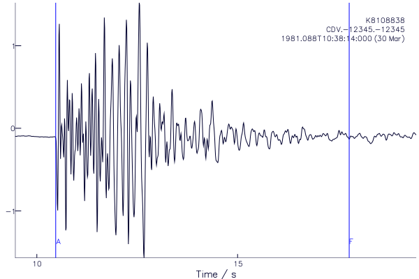
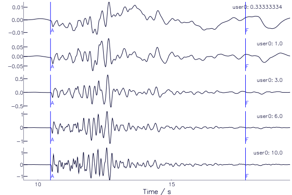

# SACPlot.jl

## What is SACPlot.jl?
A [Julia](http://julialang.org) package for plotting seismic data in the
[SAC](http://ds.iris.edu/files/sac-manual/manual/file_format.html) format,
designed to work with the [SAC.jl](https://github.com/anowacki/SAC.jl)
module.


## How to install
Although not registered as an official package, SACPlot.jl can be added to your
Julia install like so:

```julia
Pkg.clone("https://github.com/anowacki/SACPlot.jl")
```

You also need to install the unregistered package SAC.jl:

```julia
Pkg.clone("https://github.com/anowacki/SAC.jl")
```

You then need only do

```julia
using SACPlot
```

and if that works, you're ready to go.


## How to use
### SAC.jl
SACPlot.jl relies on the SAC.jl and PyPlot.jl packages, so make sure to install
these first (and their respective dependencies).

### Simple plots
As an example, let's plot the sample data that comes with SAC.jl:

```julia
julia> using SACPlot

julia> t=SAC.sample();

julia> plot1(t)
```

Assuming your PyPlot installation works, and you are in the REPL or another
interactive environment, you should see a plot:



### Plotting multiple traces
Simply pass an array of traces in to `plot1` (also called `p1`).  The following
example creates a set of traces showing the effect of changing the limit of a
lowpass filter, ranging from 0.33&nbsp;Hz to 1.67&nbsp;Hz.  We put the corner
frequency in header variable `user0`, and pass the name of this variable as a
symbol to the `plot1` method (`label=:user0`), which then shows this on the
right of each plot.

```julia
julia> using SAC

julia> function sample_plot()
       A = SACtr[SAC.sample() for i in 1:5]
       rtrend!(A)
       taper!(A)
       for (i, freq) in zip(eachindex(A), [1/3, 1, 3, 6, 10])
           lowpass!(A[i], freq)
	   A[i].user0 = freq
       end
       plot1(A, label=:user0)
       end
sample_plot (generic function with 1 method)

julia> sample_plot()
```




## Getting help
Functions are documented, so at the REPL type `?` to get a `help?>` prompt,
and type the name of the function:

```julia
help?> plot1
search: plot1 plot2 plotsp plotpm SACPlot PyPlot prevfloat parsefloat PartialQuickSort

  plot1(s::Array{SACtr}; xlim=[NaN, NaN], ylim=[NaN, NaN], label=:default, title="")

  Create a plot of the SAC trace(s) s.

  Define limits in time with xlim

  Define dependent variable axis limits with ylim, which can be a 2-array of values, or
  "all" to set all axes to have the same automatic limits.

  Define the text labels with an array of sumbols, which correspond to the names of SAC
  headers.
```

## Dependencies
- [SAC.jl](https://github.com/anowacki/SAC.jl)
- [PyPlot.jl](https://github.com/stevengj/PyPlot.jl)

Install these with the following commands:

```julia
Pkg.add("PyPlot"); Pkg.clone("https://github.com/anowacki/SAC.jl")
```
