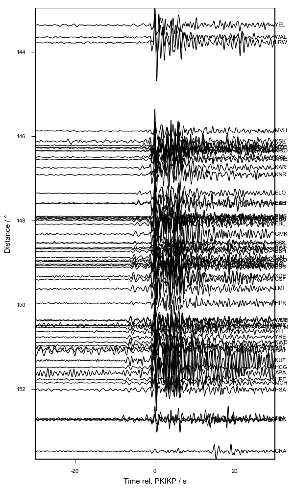
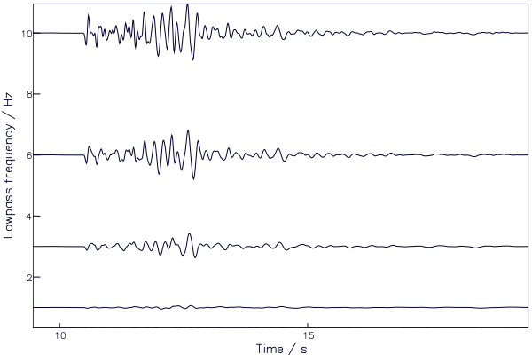

# SACPlot.jl

## What is SACPlot.jl?
A [Julia](http://julialang.org) package for plotting seismic data in the
[SAC](http://ds.iris.edu/files/sac-manual/manual/file_format.html) format,
designed to work with the [SAC.jl](https://github.com/anowacki/SAC.jl)
module.

SACPlot.jl is compatitble with Julia v0.7+.

## How to install
First install the unregistered package SAC.jl:

```julia
julia> import Pkg

julia> Pkg.add("https://github.com/anowacki/SAC.jl")
```

Then you can install the package itself:

```julia
julia> Pkg.add("https://github.com/anowacki/SACPlot.jl")
```

You then need only do

```julia
using SACPlot
```

and if that works, you're ready to go.

(Older versions of SACPlot compatible with Julia v0.6 can be installed like so:
`Pkg.clone("https://github.com/anowacki/SAC.jl"); Pkg.clone("https://github.com/anowacki/SACPlot.jl")`.)


## How to use
### SAC.jl
SACPlot.jl relies on the SAC.jl and [Plots.jl](https://github.com/JuliaPlots/Plots.jl) packages, so make sure to install
these first (and their respective dependencies).

### Simple plots
As an example, let's plot the sample data that comes with SAC.jl:

```julia
julia> using SAC, SACPlot

julia> t = SAC.sample();

julia> plot1(t)
```

Assuming your Plots.jl installation works, and you are in the REPL or another
interactive environment, you should see a plot:


### Plotting multiple traces
Simply pass an array of traces in to `plot1` (also called `p1`).  The following
example creates a set of traces showing the effect of changing the limit of a
lowpass filter, ranging from 0.33&nbsp;Hz to 10&nbsp;Hz.  We put the corner
frequency in header variable `user0`, and pass the name of this variable as a
symbol to the `plot1` method (`label=:user0`), which then shows this on the
right of each plot.

```julia
julia> using SAC, SACPlot

julia> A = [SAC.sample() for i in 1:5]  |> rtrend! |> taper!
5-element Array{SAC.SACtr,1}:
 SAC.SACtr(delta=0.01, b=9.459999, npts=1000, kstnm=CDV, gcarc=3.357463, az=88.14708, baz=271.8529)
 SAC.SACtr(delta=0.01, b=9.459999, npts=1000, kstnm=CDV, gcarc=3.357463, az=88.14708, baz=271.8529)
 SAC.SACtr(delta=0.01, b=9.459999, npts=1000, kstnm=CDV, gcarc=3.357463, az=88.14708, baz=271.8529)
 SAC.SACtr(delta=0.01, b=9.459999, npts=1000, kstnm=CDV, gcarc=3.357463, az=88.14708, baz=271.8529)
 SAC.SACtr(delta=0.01, b=9.459999, npts=1000, kstnm=CDV, gcarc=3.357463, az=88.14708, baz=271.8529)

julia> freqs = [1/3, 1, 3, 6, 10];

julia> A[:user0] = freqs;

julia> lowpass!.(A, freqs);

julia> p1(A)
```


### Record sections
Record sections are plotted with `plotrs`:

Note that the y-axis variable is set using the keyword argument `y=<value>`,
and defaults to `:gcarc`, the epicentral distance, as is usual for record
sections.

Aligning traces on a certain arrival, say, is as simple as passing a second
argument to `prs`.  It can be a header `Symbol` (e.g., `:a`) or an array of
numbers (e.g., `prs(A, :a)` or `prs(A, rand(length(A)))`).  Let's plot some
data for the UK network from an event beneath Fiji, which has picks for the
PKIKP phase in header `:a`:

```julia
julia> B = SAC.sample(:array); # Load sample data

julia> B = cut(B, :a, -30, :a, 30); # Cut traces

julia> import Pkg; Pkg.add("Plots"); # This allows us to call Plots directly below

julia> import Plots; Plots.default(size=(600,1000), margin=4Plots.mm) # Change the default figure size and margin

julia> plotrs(B, :a, qdp=false, label=:kstnm, xlabel="Time rel. PKIKP / s", ylabel="Distance / °")
```



In this case we used the `label` keyword argument to label the traces by the
station name (header `:kstnm`) and add labels to the axes.  We also turned off
&lsquo;quick-and-dirty-plotting&rsquo; with the `qdp=false` option.

`plotrs` can show traces against any header value or array passed in.  Here we
plot the earlier example traces against frequency:

```julia
julia> plotrs(A, y=:user0, xlabel="Time / s", ylabel="Lowpass frequency / Hz")
```




## Getting help
Functions are documented, so at the REPL type `?` to get a `help?>` prompt,
and type the name of the function:

```julia
help?> plot1
search: plot1 plot2 plotsp plotpm SACPlot PyPlot prevfloat parsefloat PartialQuickSort

  plot1(s::Array{SACtr}; xlim=[NaN, NaN], ylim=[NaN, NaN], label=:default, title="")

  Create a plot of the SAC trace(s) s.

  Define limits in time with xlim

  Define dependent variable axis limits with ylim, which can be a 2-array of values, or
  "all" to set all axes to have the same automatic limits.

  Define the text labels with an array of sumbols, which correspond to the names of SAC
  headers.
```
